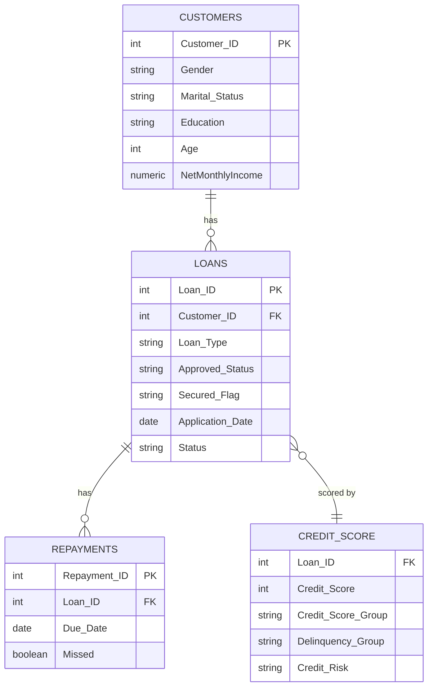
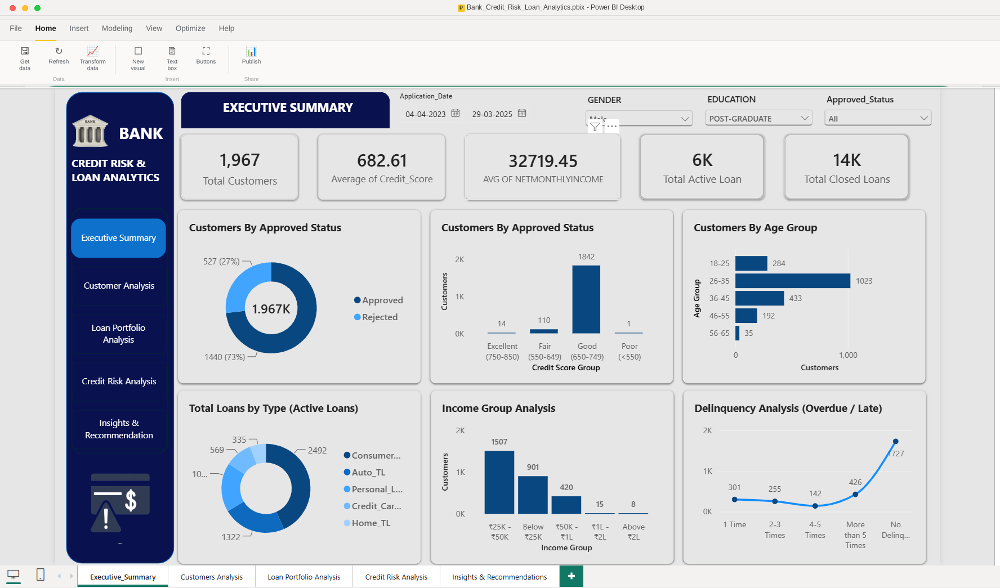
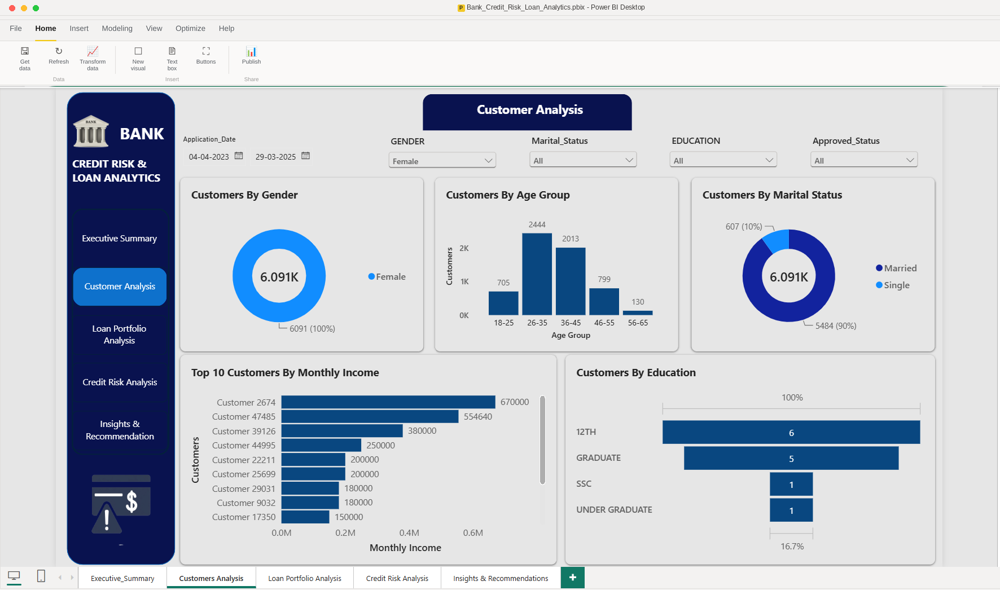
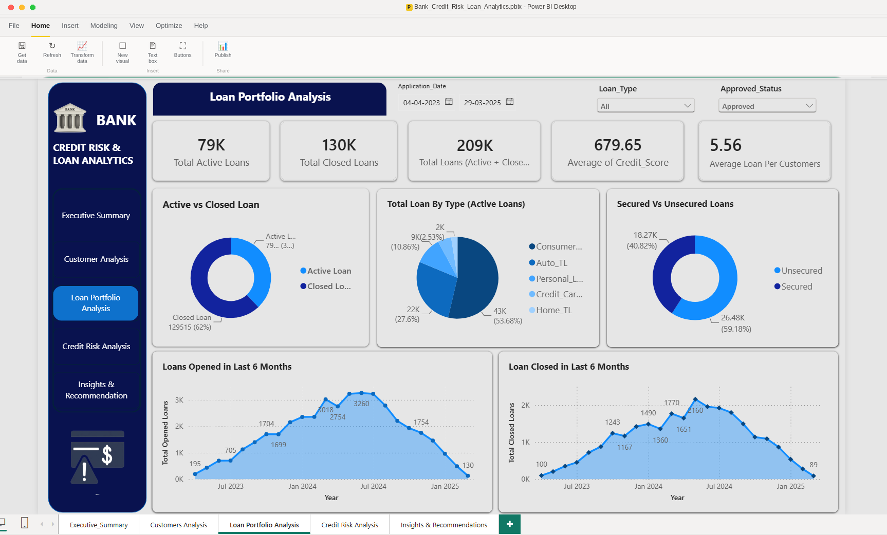
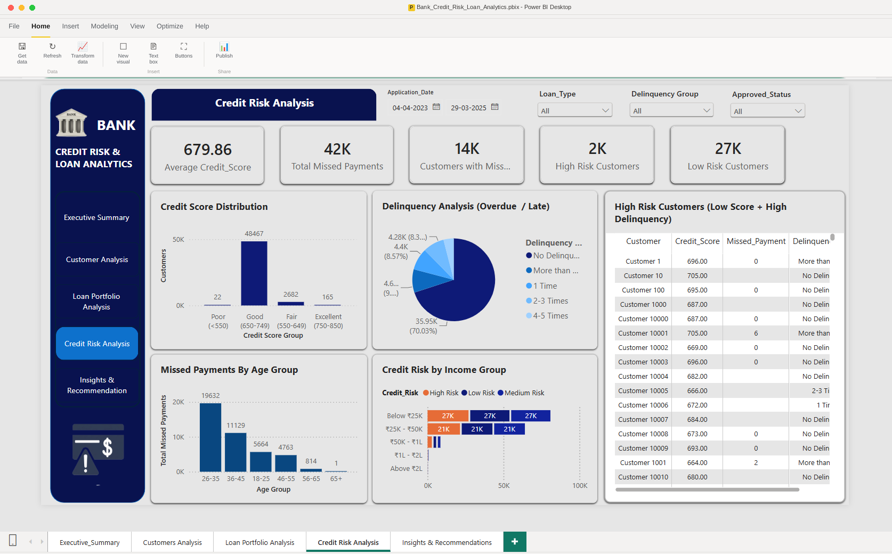
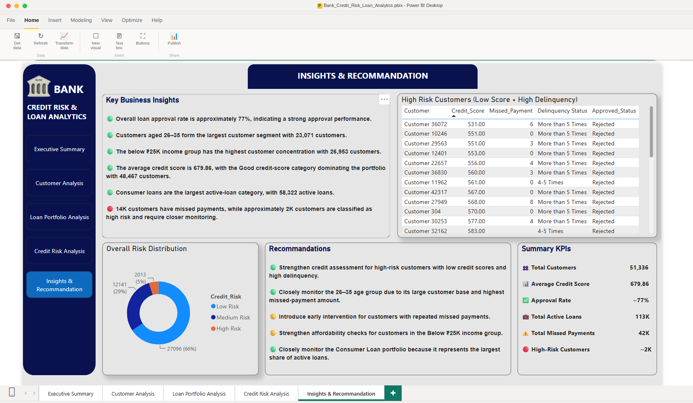

# 🏦 Bank Credit Risk & Loan Analytics — Power BI Project

[](LICENSE)
[](https://powerbi.microsoft.com/desktop/)
[](#9-contributing--license)

A Power BI dashboard project that turns raw customer, loan, and repayment data into a decision-ready **Credit Risk & Loan Analytics report** for a retail/consumer banking portfolio — built entirely in Power BI Desktop with Power Query (M) for data transformation and DAX for measures.

---

## Table of Contents
1. [Project Overview & Goals](#1-project-overview--goals)
2. [Tech Stack & Architecture](#2-tech-stack--architecture)
3. [Key Features & Report Pages](#3-key-features--report-pages)
4. [Install, Run, Validate & Deploy](#4-install-run-validate--deploy)
5. [Example Usage & Common Workflows](#5-example-usage--common-workflows)
6. [Data Model Overview](#6-data-model-overview)
7. [UI/UX Highlights & Accessibility](#7-uiux-highlights--accessibility)
8. [Screenshots](#8-screenshots)
9. [Contributing & License](#9-contributing--license)
10. [Deployment Pipeline & Security](#10-deployment-pipeline--security)

---

## 1) Project Overview & Goals

This project is a **Power BI (.pbix)** report — not a web application. It's designed for banking credit and risk teams who need a single, interactive view of the loan portfolio's health, without writing SQL or waiting on ad-hoc reports.

**Goals**
| Goal | Description |
|---|---|
| Portfolio visibility | Give leadership a real-time view of the loan book — active vs. closed loans, approval rates, credit score mix |
| Risk identification | Surface high-risk customers (low credit score + high delinquency) for proactive follow-up |
| Segment understanding | Break the customer base down by demographics, income, and education to inform lending policy |
| Self-service filtering | Let credit officers slice by loan type, delinquency group, approval status, gender, education, and date range without touching the underlying data |

---

## 2) Tech Stack & Architecture

| Component | Tool |
|---|---|
| Report authoring | Power BI Desktop |
| Data transformation | Power Query (M language) |
| Calculations / metrics | DAX measures |
| Data model | Star schema, built in Power BI's internal Tabular model |
| Data sources | Excel / CSV extracts (Customers, Loans, Repayments) — or a SQL Server / SQL database, depending on your environment |
| Publishing & sharing | Power BI Service (app.powerbi.com) |
| Optional embedding | Power BI Embedded, if the report is surfaced inside another internal application |
| Version control (optional) | Power BI Project (`.pbip`) format + Git, so report definitions (TMDL/JSON) can be diffed and reviewed like code |

### Architecture flow

```
Source data (Excel / CSV / SQL DB)
        │
        ▼
  Power Query (M) — clean, shape, merge tables
        │
        ▼
  Tabular Data Model — relationships, DAX measures
        │
        ▼
  Report Pages (visuals, slicers, bookmarks)
        │
        ▼
  Publish to Power BI Service → Workspace → Shared as App / scheduled refresh
```

### Repository structure

```
bank-credit-risk-analytics/
├── CreditRiskLoanAnalytics.pbix     # Main Power BI report file
├── data/                            # Sample/source data extracts (if shareable, non-sensitive)
│   ├── customers.csv
│   ├── loans.csv
│   └── repayments.csv
├── images/                          # Dashboard screenshots for documentation
├── docs/
│   └── data-dictionary.md           # Column-level definitions for each table
├── LICENSE
└── README.md
```

> Note: if your data source contains real/sensitive customer information, do **not** commit raw data files to the repo — keep `data/` for anonymized sample data only, and connect the live report to a secured database or file share instead.

---

## 3) Key Features & Report Pages

The report is organized into **five pages**, navigable via the tab bar at the bottom of the report:

### 📊 Executive Summary
Headline KPIs (Total Customers, Average Credit Score, Average Net Monthly Income, Total Active Loans, Total Closed Loans), plus:
- Customers by Approved Status (donut + bar chart)
- Customers by Credit Score Group
- Customers by Age Group
- Total Loans by Type (Active Loans)
- Income Group Analysis
- Delinquency Analysis (Overdue/Late) trend line

### 👥 Customer Analysis
- Customers by Gender, Age Group, and Marital Status
- Top 10 Customers by Monthly Income
- Customers by Education level
- Slicers: Gender, Marital Status, Education, Approved Status, Application Date range

### 💰 Loan Portfolio Analysis
- KPI cards: Total Active Loans, Total Closed Loans, Total Loans, Average Credit Score, Average Loan per Customer
- Active vs. Closed Loan split
- Total Loan by Type (Active Loans)
- Secured vs. Unsecured Loans
- Loans Opened / Loans Closed in Last 6 Months (trend charts)

### ⚠️ Credit Risk Analysis
- KPI cards: Average Credit Score, Total Missed Payments, Customers with Missed Payments, High Risk Customers, Low Risk Customers
- Credit Score Distribution (Poor / Fair / Good / Excellent bands)
- Delinquency Analysis (Overdue/Late) breakdown
- Missed Payments by Age Group
- Credit Risk by Income Group
- **High Risk Customers table** (low score + high delinquency) — drillable, sortable

### 💡 Insights & Recommendations
- Auto-curated Key Business Insights (e.g., approval rate, largest customer segment, average credit score)
- Overall Risk Distribution chart
- Recommendations panel (e.g., strengthen assessment for high-risk customers, monitor top age/income segments)
- Summary KPI panel for a quick leadership read-out

### Interactivity
- Cross-filtering: clicking any chart filters every other visual on the page.
- Slicers: Application Date range, Loan Type, Delinquency Group, Approved Status, Gender, Education, Marital Status.
- Drill-through from summary visuals into the High Risk Customers table for a specific segment.

---

## 4) Install, Run, Validate & Deploy

### Prerequisites
- [Power BI Desktop](https://powerbi.microsoft.com/desktop/) (free) — Windows only.
- A Power BI Pro or Premium Per User license if you plan to publish/share via the Power BI Service.
- Access to the source data (Excel/CSV files or a database connection string).

### Run the report locally

1. Clone or download this repository:
   ```bash
   git clone https://github.com/your-org/bank-credit-risk-analytics.git
   cd bank-credit-risk-analytics
   ```
2. Open `CreditRiskLoanAnalytics.pbix` in Power BI Desktop.
3. If prompted, update the data source path/connection under:
   `Home → Transform data → Data source settings → Change Source`
4. Click **Refresh** on the Home ribbon to load the latest data.

### Validate the data model
Before publishing, run through this checklist:
- [ ] All Power Query steps run without errors (`Transform data → Queries` — no red error icons).
- [ ] Relationships in the Model view match the expected star schema (see [Data Model Overview](#6-data-model-overview)).
- [ ] Key DAX measures return sensible values (spot-check totals against source data).
- [ ] No "blank" or mismatched fields in slicers (indicates a broken relationship or data type issue).
- [ ] Visuals render correctly at both desktop and mobile layout (`View → Mobile layout`).

### Publish to Power BI Service

```bash
# From Power BI Desktop:
Home → Publish → select target Workspace (e.g., "Credit Risk - Dev")
```

Then, in the Power BI Service:
1. Go to the dataset's **Settings → Data source credentials** and configure the gateway (if the source is on-prem) or cloud connection.
2. Set up a **Scheduled Refresh** (e.g., daily at 6 AM) under **Settings → Scheduled refresh**.
3. Create a **Workspace App** or share the report directly with the Credit Risk team, using row-level security roles if needed (see [Section 10](#10-deployment-pipeline--security)).

---

## 5) Example Usage & Common Workflows

**Workflow: Credit officer reviews high-risk customers**
1. Open the report → go to **Credit Risk Analysis**.
2. Use the *Delinquency Group* slicer to filter to "More than 5 Times".
3. Review the **High Risk Customers** table — sort by `Credit_Score` ascending to prioritize the lowest scores.
4. Cross-check against the **Missed Payments by Age Group** chart to see if the flagged customers cluster in a specific age band.

**Workflow: Leadership monthly portfolio review**
1. Open **Executive Summary**.
2. Set the *Application_Date* range to the reporting month.
3. Screenshot or export the page (`File → Export → Export to PDF/PowerPoint`) for the board deck.

**Workflow: Comparing loan types**
1. Go to **Loan Portfolio Analysis**.
2. Use the *Loan_Type* slicer to isolate "Consumer" loans.
3. Compare **Secured vs. Unsecured** split and the 6-month **Loans Opened/Closed** trend for that loan type only.

---

## 6) Data Model Overview

The report uses a star schema with a central `Loans` fact table and supporting dimension tables.



### Example DAX measures used in the report

```DAX
Average Credit Score =
AVERAGE ( CreditScore[Credit_Score] )

Total Active Loans =
CALCULATE (
    COUNTROWS ( Loans ),
    Loans[Status] = "Active"
)

Approval Rate % =
DIVIDE (
    CALCULATE ( COUNTROWS ( Loans ), Loans[Approved_Status] = "Approved" ),
    COUNTROWS ( Loans )
)

High Risk Customers =
CALCULATE (
    DISTINCTCOUNT ( CreditScore[Customer_ID] ),
    CreditScore[Credit_Risk] = "High Risk"
)

Total Missed Payments =
CALCULATE (
    COUNTROWS ( Repayments ),
    Repayments[Missed] = TRUE ()
)
```

> These are representative examples — update them to match the exact table/column names in your own data model before relying on them.

Full column-level definitions live in [`docs/data-dictionary.md`](docs/data-dictionary.md).

---

## 7) UI/UX Highlights & Accessibility

- **Consistent visual theme**: dark navy sidebar/header with a light gray canvas, matching color coding for risk levels (red = high risk, blue/teal = low risk) across every page.
- **Persistent navigation**: a left-hand button bar (Executive Summary, Customer Analysis, Loan Portfolio Analysis, Credit Risk Analysis, Insights & Recommendations) stays visible on every page for one-click navigation.
- **Progressive disclosure**: KPI cards up top, summary charts in the middle, and detailed drillable tables (e.g., High Risk Customers) lower on the page — so users see the headline first and can dig deeper only if needed.
- **Responsive/mobile layout**: a mobile-optimized layout is configured in Power BI Desktop (`View → Mobile Layout`) for on-the-go review in the Power BI mobile app.

**Accessibility considerations in Power BI:**
- Alt text added to every visual (`Format visual → General → Alt text`) so screen readers can describe each chart.
- Tab order configured (`View → Selection Pane` / `Tab Order`) so keyboard users navigate visuals in a logical sequence.
- A high-contrast-friendly palette is used, and risk levels are labeled in text/legends, not conveyed by color alone.
- Titles and axis labels are descriptive and avoid relying on abbreviations without context (e.g., "Below ₹25K" rather than just a code).

---

## 8) Screenshots

Dashboard screenshots live in the [`images/`](images/) directory. Use clear, numbered, kebab-case filenames so they sort correctly:

```
images/
├── dashboard-01-executive-summary.png
├── dashboard-02-customer-analysis.png
├── dashboard-03-loan-portfolio-analysis.png
├── dashboard-04-credit-risk-analysis.png
└── dashboard-05-insights-recommendations.png
```

Embed them in Markdown like this:

```markdown
### Executive Summary


### Customer Analysis


### Loan Portfolio Analysis


### Credit Risk Analysis


### Insights & Recommendations

```

Rendered output:

### Executive Summary


### Customer Analysis


### Loan Portfolio Analysis


### Credit Risk Analysis


### Insights & Recommendations


### How to generate the images
From Power BI Desktop, for each report page:
1. Go to the page → `File → Export → Export to PDF`, or simply take a screenshot of the page at a consistent resolution (e.g., 1920×1080 or full-screen).
2. Save/export as PNG and rename per the convention above.
3. Place the file in `images/` and commit — GitHub will render it automatically wherever it's referenced in this README.

If you don't have exported images yet, use a placeholder until real screenshots are ready:

```markdown

```

> Tip: compress PNGs with `pngquant` or `oxipng` before committing to keep the repository lightweight.

---

## 9) Contributing & License

### Contributing

Because `.pbix` is a binary file, standard Git diffs don't work well against it directly. To collaborate effectively:

1. Save the report using **Power BI Project format** (`File → Save As → .pbip`) if you're on a recent Power BI Desktop version — this splits the report into readable TMDL/JSON files that Git can diff.
2. Create a feature branch: `git checkout -b feature/short-description`
3. Make your changes in Power BI Desktop (new visuals, DAX measures, Power Query steps).
4. Document any new/changed measures in [`docs/data-dictionary.md`](docs/data-dictionary.md).
5. Open a Pull Request describing the change, and include before/after screenshots of any affected report page.
6. Get at least one review/approval before merging.

Please read [`CONTRIBUTING.md`](CONTRIBUTING.md) before submitting a PR. Report bugs or request features via [GitHub Issues](../../issues).

### License

This project is licensed under the [MIT License](LICENSE). See the `LICENSE` file for full terms.

---

## 10) Deployment Pipeline & Security

### Deployment across environments

If your team promotes reports through Dev → Test → Prod:
- Use **Power BI Deployment Pipelines** (available with Premium/Fabric capacity) to move the report and its dataset between workspaces with a controlled, auditable process.
- Alternatively, automate publishing via the **Power BI REST API** (e.g., `POST /groups/{groupId}/imports`) from a CI pipeline (GitHub Actions/Azure DevOps) using a registered Azure AD app + service principal.
- Keep environment-specific data source connection strings out of the `.pbix`/`.pbip` file — manage them via **Data source credentials** in each workspace, or parameterize the Power Query source using Power BI parameters.

### Security considerations

- **Row-Level Security (RLS)**: define roles (e.g., "Regional Manager" sees only their region's customers) in Power BI Desktop under `Modeling → Manage roles`, and assign users/groups to roles in the Power BI Service after publishing.
- **Data sensitivity**: apply Microsoft Purview **sensitivity labels** to the report/dataset if it contains PII (names, income, credit scores).
- **Least-privilege sharing**: share via a Workspace App with **Viewer** access for most business users; reserve **Contributor/Member** roles for report developers only.
- **Credential hygiene**: never hardcode database credentials in Power Query — use a Gateway with stored/managed credentials, or Azure AD-based authentication for cloud data sources.
- **Audit logging**: enable Power BI **Activity Log / Audit Log** (via Microsoft Purview compliance portal or the Power BI Admin Portal) to track who viewed, edited, or exported the report.
- **Sample/anonymized data only in the public repo**: if this repository is public, ensure any committed `data/` files are anonymized or synthetic — never commit real customer data.

---

## Maintainers

Maintained by the project owner(s) — see [`CONTRIBUTING.md`](CONTRIBUTING.md) for contact details. For questions, open a [Discussion](../../discussions) or an [Issue](../../issues).
